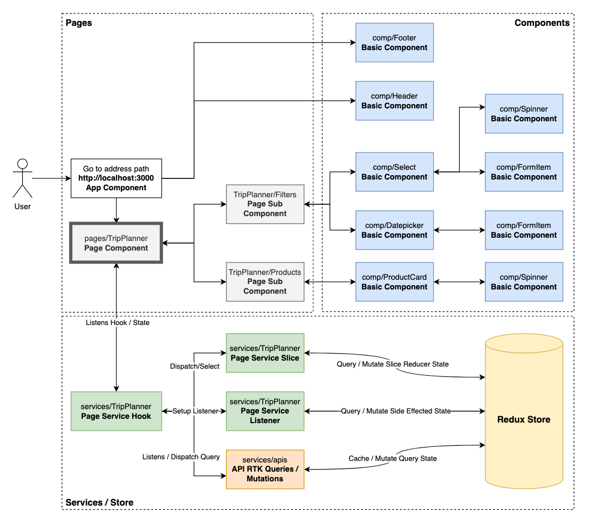

# Tiqets Frontend Assignment

This project includes trip planner React application. 

## Technologies / 3rd Party Libraries

- React JS with Typescript
- Redux Toolkit + RTK Query
- SASS
- Normalize CSS
- Prettier

## Project Structure

In this project, React Hooks, RTK Queries and Redux Toolkit work together. Components, pages and services are separated layers so every layer can be developed separately.

- **components:** `Basic components which don't include any Redux or smart logic are created in this folder`
- **config:** `Common configuration files are created in this folder.`
- - **env:** `Dynamic environment variables are placed in this file.`
- **enums:** `Common enum files are created in this folder`
- **hooks:** `Common hooks are created in this folder`
- **images:** `Image source folder`
- **pages:** `All page folders are placed in this folder. They are ready to be generated`
- **redux:** `Store and common selector and dispatch hook are placed in this folder`
- **services:** `Slices, apis, listeners and related hooks with util files are placed in this folder`
- **styles:** `Sass supported style files like mixins, common variables are placed in this folder`
- **utils:** `Common util functions are placed in this folder`

## How to Run & Build

**Used Versions**

- NodeJS Version: `v16.15.1`
- npm Version: `8.11.0`

This command directly creates a build distribution: `npm install && npm run build`

## Other things that can be added / developed

- Other unit test suites
- E2E Tests
- Storybook component library
- JSDoc
- React Router for Routing
